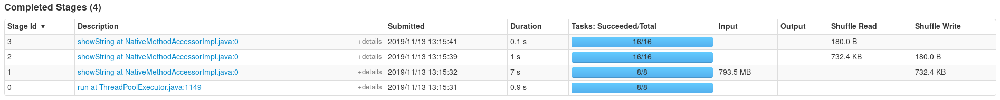
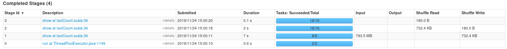

One can find in this folder the JAR file used to run the same application as in `scripts_join/final_countJoin.py` but in Scala.

Before submitting the application, you will have to build it using Maven :

```bash
# You need Maven to be installed on your machine
cd ~/spark-example-resources/scala-maven-jar/maven/

mvn package assembly:single
```

Once the above commands are done, you shall have a new JAR file named `taxicount-jar-project.jar` in the `target` folder.

To submit the program, you can use the following with your own arguments:


```bash
cd ~/spark-example-resources/scala-maven-jar/maven/

spark-submit --master yarn --class com.ferdi.spark.scala.taxiCount  \
  --deploy-mode cluster --queue adaltas  \
  ./target/taxicount-jar-project.jar \
  # Add your own file path
  <YOUR_OWN_PATH_TO_FILE>/nyctrip/trip_taxi.csv
```

The Scala equivalent program is not more performant as the Python one, comparing on the stages duration. It concerns applications that are more complexe (the ones with UDFs, for example).

**Python**: 



**Scala**:


